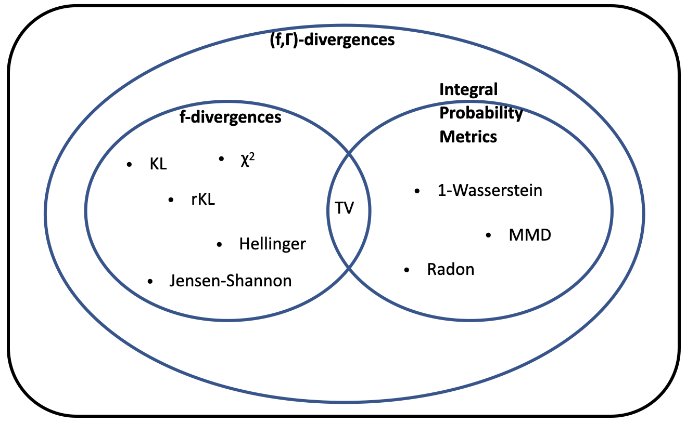
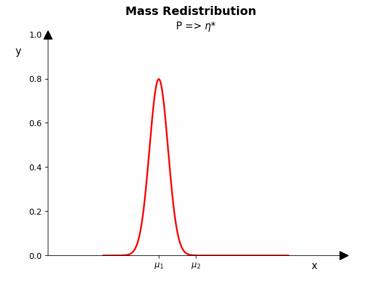

Under Construction

# (ƒ , $\Gamma$)-Divergence
Visualized examples from [Dupui's and Mao's](https://arxiv.org/pdf/2011.08441.pdf) and [Birrell's](https://arxiv.org/pdf/2011.05953.pdf) papers.

* Dirac Masses: Example 3.1, in [page 13](https://arxiv.org/pdf/2011.05953.pdf)
* Gaussian: Theorem 6.8, in [page 114](https://arxiv.org/pdf/2011.08441.pdf)
* Unifrom: Example 1, section (4.1) in [page 42](https://arxiv.org/pdf/2011.08441.pdf).

### Special cases of (ƒ , $\Gamma$)-divergences


# Mass Redistribution/Transport
## Dirac Masses
Here we consider a simple example involving Dirac masses where the (f, Γ)-divergence can be explicitly computed
using [Theorem 3.3](https://arxiv.org/pdf/2011.05953.pdf). This example further illustrates the two-stage mass-redistribution/mass-transport interpretation of
the infimal convolution formula and demonstrates how the location and distribution of probability mass impacts
the result.

|Case 1                               |  Case 2                                   |
|:-----------------------------------:|:-----------------------------------------:|
||      |


## Gaussian


|1) P ~ N(1, 0.5),  Q ~ N(3, 0.5)            |2) P ~ N(1, 0.5),  Q ~ N(3, 1)              |3) P ~ N(1, 1),  Q ~ N(3, 0.5)                |
|:------------------------------------------:|:------------------------------------------:|:------------------------------------------:|
||||


## Uniform


 

# Run Examples
To reproduce the achieved results run the file of your choice with the corresponding arguments. The output is a gif visualizing the Mass Redistribution and Transport respectivly to the chosen case (Dirac, Gaussian or Uniform).

## Dirac Masses (Case 2)
| Argument   | Default Value  | Info                                            |Choices                                |
|:----------:|:--------------:|:-----------------------------------------------:|:--------------------------------------:|
| `--h`      | 0.1            | [float] Position of $\eta^*(x_2)$ from 0.5      | -0.5 < h < 0.5                        |

`Note`: [Dirac case 1](scripts/Dirac_case1.py) has no arguments.

## Gaussian
| Argument   | Default Value  | Info                                            |Choices
|:----------:|:--------------:|-------------------------------------------------|:---------:|
| `--m1`     | 1.0            | [float] Mean of distribution P                  | -  
| `--sd1`    | 0.5            | [float] Standard deviation of distribution P    | -  
| `--m2`     | 3.0            | [float] Mean of distribution Q                  | -
| `--sd2`    | 1.0            | [float] Standard deviation of distribution Q    | -

`Note`: Default values corresponds to Case 2.

## Uniform
| Argument   | Default Value  | Info                                            |Choices
|:----------:|:--------------:|-------------------------------------------------|:---------:|
| `--c`      | 0.5            | [float] Parameter of distribution P             | 0 < c < e-2

`Note`: c value must be positive and less than e-2, thus 1-b ≥ 0.

# References
```
@inproceedings{Dupuis2020,
  author    = {"Paul Dupuis, Yixiang Mao"},
  title     = {"Formulation and properties of a divergence used to compare probability measures without absolute continuity and its application to uncertainty quantification"},
  journal   = {arXiv:2011.08441},
  year      = {2020},
  publisher = {"-?-"}
}
```


```
@inproceedings{Birrell2022,
  author    = {"Jeremiah Birrell, Paul Dupuis, Markos A. Katsoulakis, Yannis Pantazis, Luc Rey-Bellet"},
  title     = {"(f, Γ)-DIVERGENCES: INTERPOLATING BETWEEN, f -DIVERGENCES AND INTEGRAL PROBABILITY METRICS"},
  journal   = {arXiv preprint arXiv:2011.05953},
  year      = {2022},
  publisher = {"Journal of Machine Learning Research"}
}
```
